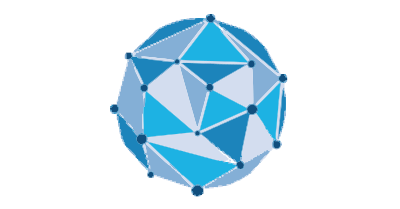

# *thgsp*

A **g**raph **s**ignal **p**rocessing toolbox built on [py**tor**ch](https://github.com/pytorch/pytorch).

The repository now mainly consists of the following stuffs:
1. GFT-based filter(banks) processing multi-dimensional signals in a Multiple Input Multiple Output(MIMO) manner.
2. GraphQmf and GraphBiorth wavelet filter bank.
3. Many strategies to decompose an arbitrary graph into many(usually <10) bipartite graphs.

As this package is built on [PyTorch](https://(pytorch.org/>)  and
[pytorch_sparse](https://github.com/rusty1s/pytorch_sparse>), you can easily integrate functionalities here into a 
PyTorch pipeline. Check the [document](https://thgsp.readthedocs.io/en/latest/) for installation and introduction.

## Table of Contents
- [Example](#example)
- [Reference](#reference)
- [Citation](#citation)
- [License](#license)

## Example

### GraphQMF four channel wavelet filter bank on Minnesota

The Minnesota traffic network is 3-colorable(exactly) or 4-colorable(roughly). Hence 4-channel GraphQmf filterbank is 
constructed, requiring a ceil(log2(4))=2 level bipartite decomposition. The bipartite graphs are below.

The comparision between the eventual reconstructed signal and the input one.

### GraphBiorth four channel wavelet filter bank for camera man.
See the full program [here](./demos/images/bio_cmn.py).

## Reference
[David K Hammond, et al.] [Wavelets on Graphs via Spectral Graph Theory](https://arxiv.org/abs/0912.3848) \
[Sunil K. Narang, et al.] [Compact Support Biorthogonal Wavelet Filterbanks for Arbitrary Undirected Graphs](https://ieeexplore.ieee.org/document/6557512) \
[Sunil K. Narang, et al.] [Perfect Reconstruction Two-Channel Wavelet Filter Banks for Graph Structured Data](https://ieeexplore.ieee.org/document/6156471) \
[Akie Sakiyama, et al.] [Oversampled Graph Laplacian Matrix for Graph Filter Banks](https://ieeexplore.ieee.org/stamp/stamp.jsp?arnumber=6937182) \
[Sunil K. Narang, et al.] [Compact Support Biorthogonal Wavelet Filterbanks for Arbitrary Undirected Graphs](https://ieeexplore.ieee.org/document/6557512) \
[Jing Zen, et al.] [Bipartite Subgraph Decomposition for Critically Sampledwavelet Filterbanks on Arbitrary Graphs](https://ieeexplore.ieee.org/document/7472871) \
[Aamir Anis, et al.] [Towards a Sampling Theorem for Signals on Arbitrary Graphs](https://ieeexplore.ieee.org/document/6854325) \
[Aimin Jiang, et al.] [ Admm-based Bipartite Graph Approximation](https://ieeexplore.ieee.org/document/8682548/)

## Citation

## License
MIT